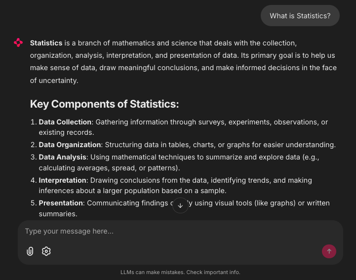

# Local AI Chat with Document Processing

**A locally operated AI chat with document processing, based on [Ollama](https://ollama.com/), [Chainlit](https://github.com/Chainlit/chainlit) and [Docling](https://github.com/docling-project/docling).**


[](https://github.com/machinelearningZH/ai-chat)
[](https://github.com/machinelearningZH/ai-chat/stargazers)
[](https://github.com/machinelearningZH/ai-chat/issues)
[](https://img.shields.io/github/issues-pr/machinelearningZH/ai-chat)
[](https://github.com/machinelearningZH/ai-chat)
<a href="https://github.com/astral-sh/ruff"></a>



## Features

- **On-Premise**: Can be setup to work locally
- **Document Processing**: Supports PDF, DOCX, PPTX, XLSX, HTML, Markdown and more. Intelligent document conversion with options for layout and structure preservation
- **Flexible Configuration**: Customizable models and parameters
- **Lightweight**: Few dependencies and easy setup

## Usage

[Install uv](https://docs.astral.sh/uv/getting-started/installation/) for environment management.

Set up [Ollama](https://ollama.com/) as your local LLM server:

```bash
# Install ollama (e.g. Linux)
curl -fsSL https://ollama.com/install.sh | sh

# Pull models, e.g.:
ollama pull hf.co/unsloth/Qwen3-30B-A3B-Instruct-2507-GGUF:q6_k
ollama pull hf.co/unsloth/Qwen3-Coder-30B-A3B-Instruct-GGUF:q6_k

# To increase the default context size that Ollama uses, you can set the environment variable OLLAMA_CONTEXT_LENGTH. For example, to set it to 32k tokens:
export OLLAMA_CONTEXT_LENGTH=32768

# Or create an alias of your model
ollama show hf.co/unsloth/Qwen3-30B-A3B-Instruct-2507-GGUF:Q6_K --modelfile > modelfile_qwen3
nano modelfile_qwen3
# To change the default context size add this line at the end:
PARAMETER num_ctx 32768
# Then create a new model with the larger context size. This does not duplicate the model files itself.
ollama create Qwen3-65k -f modelfile_qwen3
# Set this model name in config.yaml to use it in the app.
```

Install and setup the app:

```bash
git clone https://github.com/machinelearningZH/amtschat
cd amtschat
uv sync

# Adjust the configuration
nano config.yaml

# Also have a look at _core/constants.py for UI texts and prompts.
nano _core/constants.py

# Adjust the chainlit configuration
nano ~/.chainlit/config.toml
# > Make sure you disable telemetry by setting:
[telemetry]
enabled = false

# Start the app (opens in browser at http://localhost:8000):
uv run chainlit run chat.py

# Or set a specific port, watch and headless mode, and more:
# https://docs.chainlit.io/backend/command-line
uv run chainlit run chat.py -w -h --port 8501
```

## Project Information

We use this AI chat internally as a lightweight local AI assistant with document processing capabilities that we can operate on-premise. We like [Chainlit](https://docs.chainlit.io/get-started/overview) for its simplicity and configurability. We have also experimented successfully with other frameworks like [Open WebUI](https://github.com/open-webui/open-webui).

Our current go-to LLM for small on-premise servers is [Qwen3-30B-A3B-Instruct-2507](https://huggingface.co/unsloth/Qwen3-30B-A3B-Instruct-2507-GGUF), which performs well for general-purpose tasks and works sufficiently well for German language too. For coding tasks we use [Qwen3-Coder-30B-A3B-Instruct](https://huggingface.co/unsloth/Qwen3-Coder-30B-A3B-Instruct-GGUF) in this app.

## Project Team

**Chantal Amrhein**, **Patrick Arnecke** – [Statistisches Amt Zürich: Team Data](https://www.zh.ch/de/direktion-der-justiz-und-des-innern/statistisches-amt/data.html)

## Feedback and Contributing

We welcome feedback and contributions! [Email us](mailto:datashop@statistik.zh.ch) or open an issue or pull request.

We use [`ruff`](https://docs.astral.sh/ruff/) for linting and formatting.

## License

This project is licensed under the MIT License. See the [LICENSE](LICENSE) file for details.

## Disclaimer

This software (the Software) incorporates open-source models (the Models) from providers like Ollama, Huggingface, Docling and OpenAI. The app has been developed according to and with the intent to be used under Swiss law. Please be aware that the EU Artificial Intelligence Act (EU AI Act) may, under certain circumstances, be applicable to your use of the Software. You are solely responsible for ensuring that your use of the Software as well as of the underlying Models complies with all applicable local, national and international laws and regulations. By using this Software, you acknowledge and agree (a) that it is your responsibility to assess which laws and regulations, in particular regarding the use of AI technologies, are applicable to your intended use and to comply therewith, and (b) that you will hold us harmless from any action, claims, liability or loss in respect of your use of the Software.
