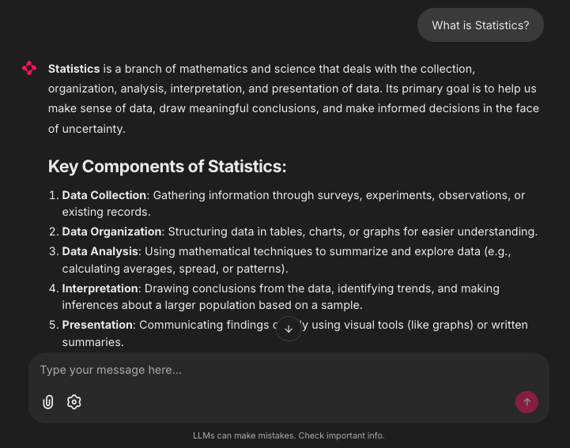

# Local AI Chat with Document Processing

A local AI chat with document processing, built with an OpenAI-compatible model server, [Chainlit](https://github.com/Chainlit/chainlit), and [Docling](https://github.com/docling-project/docling). Ollama, vLLM, and llama.cpp are supported local serving options.


[](https://github.com/machinelearningZH/ai-chat)
[](https://github.com/machinelearningZH/ai-chat/stargazers)
[](https://github.com/machinelearningZH/ai-chat/issues)
[](https://img.shields.io/github/issues-pr/machinelearningZH/ai-chat)
[](https://github.com/machinelearningZH/ai-chat)
<a href="https://github.com/astral-sh/ruff"></a>



## Features

- **Local operation:** Run on-premises with a local model server.
- **Document processing:** Convert PDF, DOCX, PPTX, XLSX, HTML, Markdown, and other formats while preserving layout and structure.
- **Flexible configuration:** Customize models, parameters, prompts, and UI text.
- **Simple setup:** Run natively or with Docker Compose.

## Usage

[Install uv](https://docs.astral.sh/uv/getting-started/installation/) to manage the environment.

Set up [Ollama](https://ollama.com/) as your local LLM server:

```bash
# Install Ollama (Linux example)
curl -fsSL https://ollama.com/install.sh | sh

# Pull the default model
ollama pull hf.co/unsloth/gemma-4-E2B-it-GGUF:q6_k

# Optional: increase Ollama's context length to 120,000 tokens
export OLLAMA_CONTEXT_LENGTH=120000
```

Larger contexts require more RAM or VRAM. See the [Ollama context-length documentation](https://docs.ollama.com/context-length).

Install and set up the app:

```bash
git clone https://github.com/machinelearningZH/ai-chat
cd ai-chat
uv sync

# Adjust the configuration
nano config.yaml

# For non-local OpenAI-compatible endpoints, put the key in .env:
# AI_CHAT_API_KEY=...

# UI text and prompts are configured under messages in config.yaml.

# Adjust the project-local Chainlit configuration if needed
nano .chainlit/config.toml
# Telemetry is already disabled with project.enable_telemetry = false.

# Add any custom port to allow_origins in .chainlit/config.toml.

# Start the app at http://localhost:8000
uv run chainlit run src/app.py

# Example with watch mode, headless mode, and a custom port
uv run chainlit run src/app.py -w -h --port 8501
```

See the [Chainlit CLI documentation](https://docs.chainlit.io/backend/command-line) for more options.

## Alternative Model Servers

The app uses the OpenAI-compatible chat completions API. vLLM and llama.cpp can
therefore replace Ollama without changes to the Python environment. Install each
server in its own supported environment; neither server is an app dependency.

The app sends the selected `model.models[].name` from `config.yaml`. By default,
the launch helpers expose the server model as `model.default_selection`. Keep
the configured context and output limits within the model and server limits;
setting a larger value in `config.yaml` does not increase a model server's
capacity.

### vLLM

[Install vLLM](https://docs.vllm.ai/en/latest/getting_started/installation/) on a
supported accelerator, then start it in one terminal. `MODEL` is a Hugging Face
model ID or a local model directory, not an Ollama model tag:

```bash
make serve-vllm MODEL=google/gemma-3-4b-it
```

In another terminal, start the app against vLLM:

```bash
make run-vllm
```

Verify the server independently at <http://127.0.0.1:8001/v1/models> if the app
cannot connect.

The defaults are `127.0.0.1:8001`. Override the port or the API alias when
needed:

```bash
make serve-vllm MODEL=/models/my-model VLLM_PORT=9001 APP_MODEL_NAME=my-model
make run-vllm VLLM_PORT=9001
```

When `APP_MODEL_NAME` differs from the current `config.yaml` model name, update
`model.default_selection` and the corresponding `model.models[].name` to the
same value before starting the app. Extra vLLM options can be supplied by calling
the helper directly, for example:

```bash
SERVED_MODEL_NAME=my-model MAX_MODEL_LEN=32768 \
  ./scripts/serve-vllm.sh google/gemma-3-4b-it --tensor-parallel-size 2
```

### llama.cpp

[Install or build llama.cpp](https://github.com/ggml-org/llama.cpp/blob/master/docs/build.md)
so that `llama-server` is on `PATH`, then point the helper at a local GGUF file:

```bash
make serve-llamacpp MODEL=/models/model.gguf
```

In another terminal, start the app against llama.cpp:

```bash
make run-llamacpp
```

Verify the server independently at <http://127.0.0.1:8002/v1/models> if the app
cannot connect.

The defaults are `127.0.0.1:8002`. Pass llama.cpp-specific options directly to
the helper; for example, to offload layers to the GPU:

```bash
SERVED_MODEL_NAME=my-model MAX_MODEL_LEN=32768 \
  ./scripts/serve-llamacpp.sh /models/model.gguf --n-gpu-layers 99
```

Set `LLAMA_SERVER_BIN` if the executable has a different path. As with vLLM,
the served alias must equal the model name in `config.yaml`.

If either server reports that `reasoning_effort` is unsupported, set
`runtime.reasoning_effort_when_thinking_disabled: null` in `config.yaml`; this
removes that optional field from requests when thinking mode is disabled.

Both helpers bind to localhost by default. If you intentionally use
`SERVER_HOST=0.0.0.0`, protect the endpoint with network controls and server
authentication; the default local dummy API key is not authentication.

## Run Scenarios

The Makefile provides shortcuts for supported local deployment scenarios. It wraps `uv` and Docker Compose; you can also run the underlying commands directly.

| Scenario | Command | Notes |
| --- | --- | --- |
| Native app + native Ollama | `make run-native` | Recommended on macOS to retain Metal acceleration |
| Native app + native vLLM | `make serve-vllm` + `make run-vllm` | Typically Linux with a supported accelerator |
| Native app + native llama.cpp | `make serve-llamacpp` + `make run-llamacpp` | GGUF models; supports CPU and platform-specific GPU offload |
| App container + native Ollama | `make app-host` | Uses `host.docker.internal` |
| App + CPU Ollama containers | `make stack-cpu` | Portable, but inference is CPU-only |
| App + NVIDIA Ollama containers | `make stack-nvidia` | Linux with NVIDIA Container Toolkit |
| App + AMD Ollama containers | `make stack-amd` | Linux with ROCm-compatible hardware |

Add `UP_FLAGS=-d` to run a Compose scenario in the background:

```bash
make stack-cpu UP_FLAGS=-d
make model MODEL=hf.co/unsloth/gemma-4-E2B-it-GGUF:q6_k
make logs
make down
```

If port 8000 is occupied, select another host port without changing the container configuration:

```bash
make app-host AI_CHAT_PORT=18001 UP_FLAGS=-d
```

`make down` preserves the `ollama-data` volume, so downloaded models survive container replacement. `make model` starts the Compose Ollama service if needed and downloads models into the Compose volume, not native Ollama's model directory. Run `make help` for all commands.

For Compose scenarios, Ollama reads the context length from the default model's `max_tokens_context` in `config.yaml`. Override it on memory-constrained machines:

```bash
make stack-cpu OLLAMA_CONTEXT_LENGTH=8192 UP_FLAGS=-d
```

Larger contexts require substantially more RAM or VRAM. With native Ollama, set `OLLAMA_CONTEXT_LENGTH` in the host service; the Makefile cannot change the environment of an existing host process.

The Compose files pin Ollama to version `0.32.0`. To test another pinned release, override it explicitly:

```bash
make stack-cpu OLLAMA_VERSION=0.31.2 UP_FLAGS=-d
```

On macOS, containerized Ollama cannot use the Apple GPU; prefer `make run-native` or `make app-host`. The NVIDIA and AMD targets require supported Linux hosts. See the [Ollama Docker guide](https://docs.ollama.com/docker) for driver requirements.

## Docker

The image runs the app as a non-root user on port 8000. Set deployment-specific model endpoints with `AI_CHAT_BASE_URL`; `config.yaml` can retain the native default:

```yaml
openai:
  base_url: "http://localhost:11434/v1"
```

For a direct Docker run with Ollama on the host:

```sh
docker build -t ai-chat .

docker run --rm \
  --name ai-chat \
  --add-host=host.docker.internal:host-gateway \
  -p 8000:8000 \
  -e AI_CHAT_API_KEY=ollama \
  -e AI_CHAT_BASE_URL=http://host.docker.internal:11434/v1 \
  --mount type=bind,source="$(pwd)/config.yaml",target=/app/config.yaml,readonly \
  ai-chat
```

Open <http://localhost:8000>. The `ollama` value is a non-secret dummy key for the local server. For a remote OpenAI-compatible endpoint, store the real key in `.env` as `AI_CHAT_API_KEY=...` and replace the `-e` option with `--env-file .env`. The `.dockerignore` excludes `.env` from the image.

In the full Compose stack, the app connects to `http://ollama:11434/v1` over the private Compose network; Ollama's API is not published to the host. For `make app-host` on native Linux, Ollama must listen on an address reachable from Docker, not only on `127.0.0.1`. Do not expose Ollama beyond trusted interfaces.

Uploaded files and logs are ephemeral by default. If persistence is required, add narrowly scoped volume mounts for `/app/.files` or the configured log path.

The Linux image uses CPU-only PyTorch wheels because document conversion does not require GPU acceleration. BuildKit keeps uv's download cache outside the runtime image. On the tested platform, the image is about 2.2 GB unpacked and 500 MB compressed; sizes vary by platform.

## Project Team

**Chantal Amrhein**, **Patrick Arnecke** – [Amt für Statistik und Daten Kanton Zürich: Team Data](https://www.zh.ch/de/direktion-der-justiz-und-des-innern/amt-fuer-statistik-und-daten.html)

## Feedback and Contributing

For feedback or contributions, [email us](mailto:datashop@statistik.zh.ch), open an issue, or submit a pull request.

We use [`ruff`](https://docs.astral.sh/ruff/) for linting and formatting.

## License

This project is licensed under the MIT License. See [LICENSE](LICENSE).

## Disclaimer

This software (the Software) incorporates open-source models (the Models) from providers like Ollama, Hugging Face, Docling and OpenAI. The app has been developed according to and with the intent to be used under Swiss law. Please be aware that the EU Artificial Intelligence Act (EU AI Act) may, under certain circumstances, be applicable to your use of the Software. You are solely responsible for ensuring that your use of the Software as well as of the underlying Models complies with all applicable local, national and international laws and regulations. By using this Software, you acknowledge and agree (a) that it is your responsibility to assess which laws and regulations, in particular regarding the use of AI technologies, are applicable to your intended use and to comply therewith, and (b) that you will hold us harmless from any action, claims, liability or loss in respect of your use of the Software.
